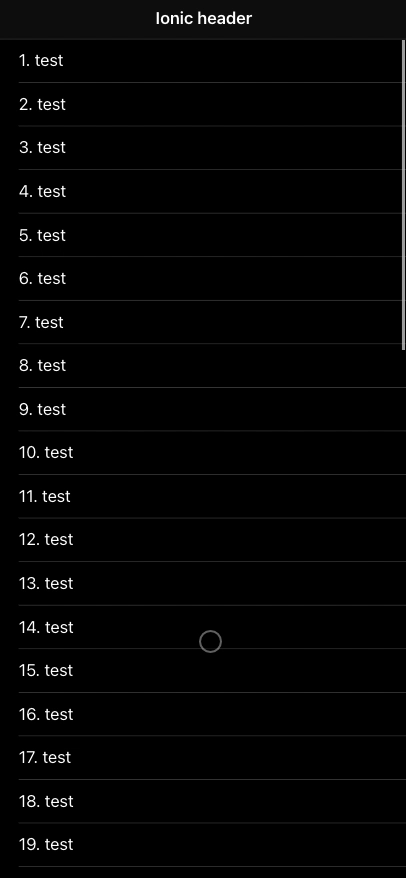
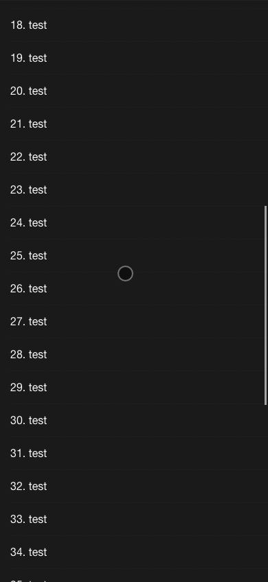

# ionic-react-header-collapse

### Easy to use hook to handle collapse effect on scroll for IonHeader component in React Ionic

> Currently the package is in beta phase. Any issue or PR will be appreciated ;)

[](https://www.npmjs.com/package/@codesyntax/ionic-react-header-collapse) [](https://standardjs.com)


IOS/Android:





## Install

```bash
npm install --save @codesyntax/ionic-react-header-collapse
```

## Usage

```tsx
import React, { Component } from 'react';

import { UseIonHeaderCollapse, useIonHeaderCollapse } from '@codesyntax/ionic-react-header-collapse';

const Home: React.FC = () => {
  const { ref } = useIonHeaderCollapse({} as UseIonHeaderCollapse);
  render() {
    return (
      <IonPage>
        <IonHeader ref={ref}>
          <IonToolbar>
            <IonTitle>Ionic header</IonTitle>
          </IonToolbar>
        </IonHeader>
        <IonContent fullscreen>
          ...
        </IonContent>
      </IonPage>
      );
  }
}
```


## License

MIT © [CodeSyntax](https://github.com/codesyntax)
